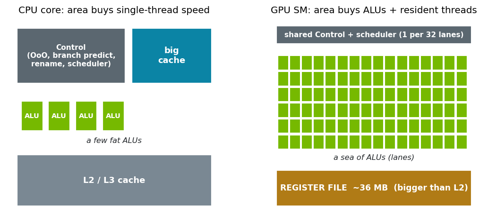
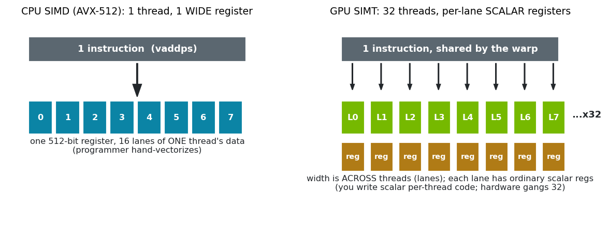
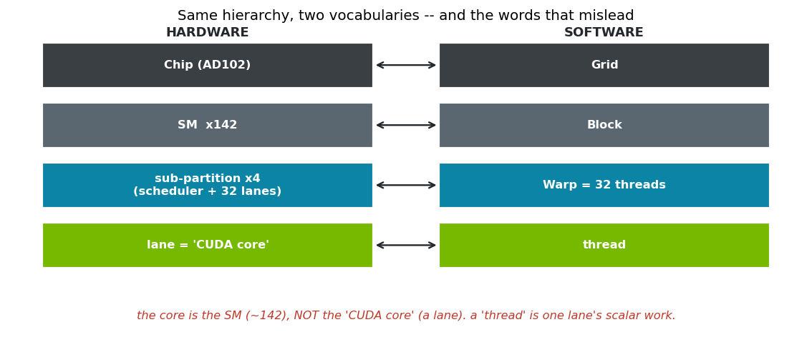
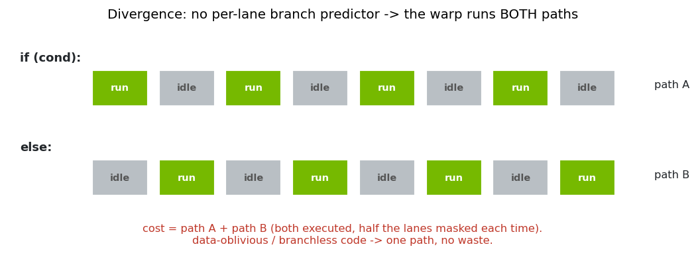
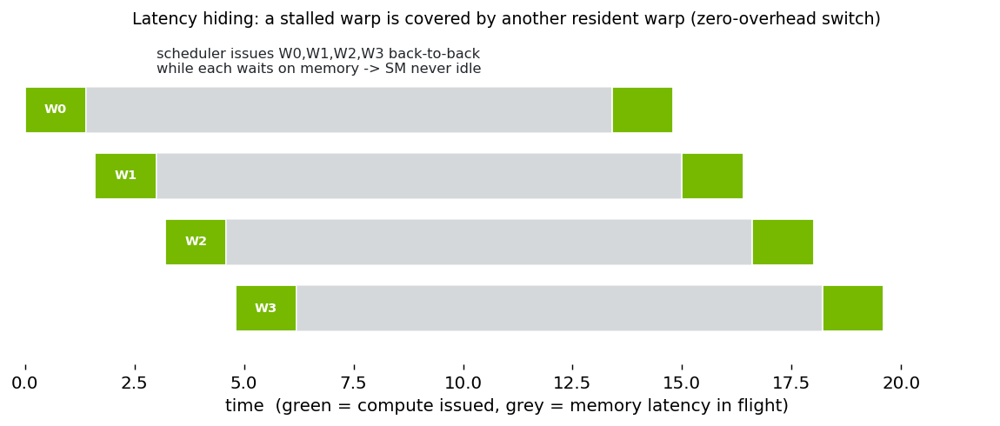
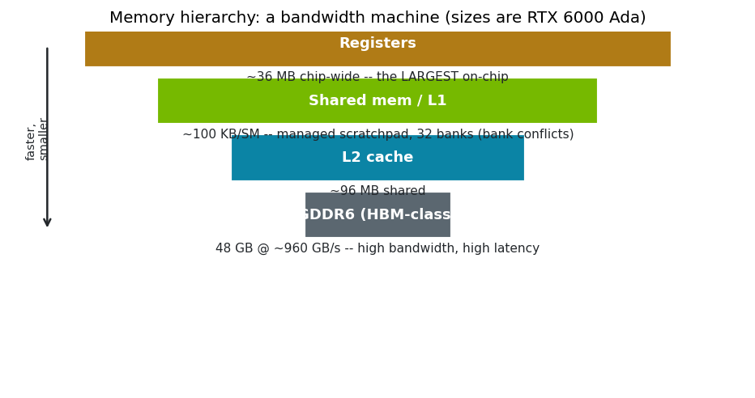
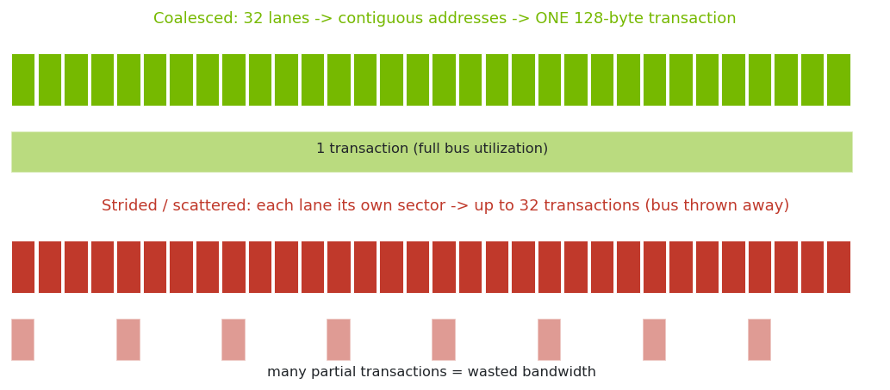

# GPU programming is cost-model first
### A one-hour tour for computer architects meeting the GPU

> **Script note (for me, the presenter).** This article is the *spoken script* — what actually has to be said, in order, for a smart-but-GPU-new architecture audience. Part 0 is the foundation the demos silently assume; if I skip it, everyone is lost by §3. Parts 1–9 are the measured demos (built in `course.ipynb`), each shown **with its actual code**.
>
> **Length:** this is the *full ~2-hour* superset on purpose — every idea with real code attached. We will iterate it down: cut, merge, and pick the ~1-hour path later. Right now the goal is to see *what content actually has to exist* to explain each thing, not to fit the clock.

---

## Part 0 — What a GPU *really* is

The audience knows CPUs cold: out-of-order execution, branch predictors, register renaming, three levels of cache, prefetchers. So the fastest way in is **by contrast** — a GPU is what you get when you spend the transistor budget on the *opposite* bet.

### 0.1 The bet: throughput over latency

A modern CPU core spends most of its **area** making a *single* instruction stream finish *fast*: branch prediction and speculation, a big out-of-order window, register renaming, deep per-core caches. All of that is latency-hiding machinery for **one** thread.

A GPU rips almost all of it out. No branch predictor. No out-of-order engine. No big per-thread cache. It spends the reclaimed area on two things instead:

1. **Many more ALUs.**
2. **The ability to keep a huge number of threads resident at once**, so it can *switch* among them.

The bet is explicit: **give up single-thread latency, buy aggregate throughput.** Everything weird about the GPU falls out of this one decision. The job of this hour is to make that bet *quantitative* — a cost model — instead of folklore.



### 0.2 SIMT: one instruction stream, many lanes — and why it saves silicon

Here is the single most important mechanism, and the one the marketing actively obscures.

A GPU does **not** have thousands of independent little cores. It has thousands of **ALUs (lanes)**, and the lanes are wired into groups — **32 lanes on NVIDIA, called a *warp*** — that **share one instruction fetch, one decode, and one scheduler**. All 32 lanes execute the *same instruction* in the same cycle, each on its *own* registers. NVIDIA calls this **SIMT** (single instruction, multiple threads); to an architect it is **SIMD execution with a per-lane register file**.

Why design it this way? **Because the control plane is what costs area on a CPU.** Fetch, decode, branch prediction, the scheduler, register renaming — that machinery dwarfs the ALU it feeds. If you force 32 lanes to run the same instruction, you **pay for that machinery once and amortize it across 32 ALUs.** One decode drives 32 ALUs; one instruction broadcast wire feeds the array. That is the "saves wire/area" point — you delete 31 of every 32 front-ends and spend the silicon on math and registers.

**The subtlety that trips people up — "wide in lanes, not wide in register."** This is *not* CPU SIMD (AVX-512). With AVX, **one** thread issues one instruction over a **512-bit register** (16 lanes of *one* thread's data); the programmer hand-vectorizes. With SIMT, you have **32 threads, each with ordinary scalar 32-bit registers**, ganged behind one instruction. The width is **across threads**, and every lane's register is normal-width. So you write **scalar, per-thread code** and the hardware runs 32 copies in lockstep. Easier to write than AVX — and the source of the leaky abstraction we'll hit in §4.



*(Aside, only if asked: other vendors pick other widths — AMD wave32/wave64 — and have their own vector-register story. The principle is identical: amortize one front-end across a lane array. I'll keep everything NVIDIA-concrete to avoid a terminology swamp.)*

### 0.3 The terminology minefield — fix it now or lose them later

GPU vocabulary is genuinely bad (partly marketing). Pin it down **once**, on a slide, and use the disambiguated words for the rest of the hour:

| Word you'll hear | What it *actually* is | CPU analogy |
|---|---|---|
| **"CUDA core"** (18,176 of them!) | one **ALU / lane**. Not a core, not independent. | one SIMD ALU lane |
| **thread** | the scalar program **one lane** runs (its registers + PC-worth of work) | one lane of a vector op — *not* an OS thread |
| **warp** | **32 threads/lanes** sharing one instruction stream; the real unit of scheduling | one SIMD instruction in flight |
| **SM** (streaming multiprocessor) | the actual processor: schedulers + register file + shared memory + the lane array | **this** is the "core" (≈142 of them) |
| **register** | a **per-lane** scalar register; the per-SM register file is huge and *shared out* among resident warps | register file, but partitioned by occupancy |
| **occupancy** | how many warps are resident (set by register/shared use) → how much latency you can hide | SMT depth, but knob-controlled |

The one sentence that reorients an architect: **an SM is the core; a warp is a SIMD instruction; a "CUDA core" is a SIMD lane; a "thread" is one lane's scalar work.** "18,176 cores" really means "18,176 ALUs" = 142 SMs × 128 lanes. Hold that and the rest stops being mysterious.



### 0.4 No branch predictor → predication and divergence

If 32 lanes share one instruction stream, what happens at an `if`? There is **no per-lane branch predictor** (that would defeat the shared front-end). Instead the warp uses **predication / masking**: when lanes disagree, the warp executes **both sides of the branch**, with the non-participating lanes **masked off**, then reconverges. Cost = sum of both paths. This is **divergence**, and it's why data-dependent control flow is a *performance* problem on a GPU even though it's free on a CPU. It's also why GPU library code leans on **branchless, data-oblivious** kernels (sorting networks, etc.) — we'll *measure* this in §4.



*(One-line caveat if an expert pushes: since Volta, lanes have independent program counters for correctness/forward-progress, but execution is still warp-wide SIMD with reconvergence. The lockstep mental model is the right one for performance.)*

### 0.5 Each op is slow → hide it by oversubscription, not by speculation

Having deleted the out-of-order engine and the big caches, **each individual operation is high-latency** — a dependent global-memory load is **hundreds of cycles** (we'll measure ~230 ns ≈ 580 cycles), and there's no OoO window to hide it *within* a thread.

So how does the chip stay busy? **Concurrency.** Each SM keeps **many warps resident** (up to 48 on our chip) and a warp scheduler that, the moment a warp stalls on memory, **switches to another ready warp in the same cycle** — a *zero-overhead* context switch. Zero-overhead because **the register file physically holds every resident warp's registers at once**; there's nothing to save or restore. This is SMT/hyperthreading taken to an extreme (think 48-way), and it is *the* latency-hiding strategy: not "make the op fast," but "always have other work ready." Little's law sets the requirement: enough threads in flight to cover the latency × bandwidth product. §3 proves this on a *single* SM so it can't be confused with "just use more cores."



### 0.6 The memory system: a bandwidth machine — if you feed it right

The other half of the throughput bet is memory **bandwidth**. Our chip's GDDR6 moves ~**960 GB/s**; a CPU's DRAM is ~100 GB/s. The hierarchy, fastest→slowest:

- **Registers** — per-lane, and in *aggregate the largest on-chip memory* (~36 MB across the chip). Counterintuitive to a CPU person: the register file is bigger than the L2.
- **Shared memory** — a per-SM, **programmer-managed scratchpad** (not a cache). ~100 KB/SM, organized in 32 **banks**; if lanes of a warp hit the same bank, accesses **serialize** (a *bank conflict* — the "conflicts" to watch).
- **L1 / L2 cache** — L2 is a big shared band (~96 MB here).
- **HBM/GDDR** — high bandwidth, high latency.



The catch that makes or breaks everything: bandwidth only materializes if a warp's 32 lanes touch **contiguous** addresses, so the memory system can fuse them into one wide transaction. That's **coalescing**. Scattered/strided access turns one transaction into many and throws the bus away. So "is your access pattern coalesced?" is the GPU equivalent of "do you fit in cache?" — and we'll watch a profiler catch exactly this (§7b).



### 0.7 Where it all lives — a die shot

> **[INSERT: annotated AD102 die shot.]** Point the camera at silicon so the abstractions land physically. Annotate **only**:
> - the **grid of repeated tiles** = the **SM array** ("the cores — ~142 of them");
> - **one SM zoomed** = 4 sub-partitions, each a **warp scheduler + 32 lanes**; the **register file** bank; the **shared-memory/L1** block;
> - the **central band** = **L2 cache** (~96 MB);
> - the **edge blocks** = **memory controllers / GDDR PHYs** (the bandwidth).
>
> **Explicitly wave off** the tensor cores, RT cores, and graphics/raster hardware: *"Ignore these — they're vendor-specific accelerators for regular (matmul) or irregular (ray) work, a different programming model we are not covering. The general-purpose story is the SM array + cache + memory controllers."*

The point of the image: "cores" you can count are SMs; the thing called a CUDA core is a sliver of a sub-partition; the L2 and the memory PHYs are *enormous* — because this is a memory machine.

### 0.8 Read the spec sheet like an architect (and how to buy a GPU)

Now make it concrete: pull the real card's numbers and read each one *through the cost model*. Two commands tell you almost everything — if you know which lines are load-bearing.

**`nvidia-smi`** — the *operator's* view (driver, power, thermals, who's using it):

```text
NVIDIA-SMI 580.159.03    Driver 580.159.03    CUDA Version: 13.0
| NVIDIA RTX 6000 Ada Generation        | Bus 0000:51:00.0      |
| 30%  39C  P8   27W / 300W  | 38MiB / 49140MiB | 0% Default     |
```

How to read it: **300 W** power cap (boost clocks are *thermal/power*-limited → sustained ≠ peak), **48 GB** (49140 MiB) framebuffer, **P8** = idle power state, **0 %** util, ~**39 °C**. `nvidia-smi -q` adds **PCIe Gen4 ×16** (your host↔device pipe ≈ 32 GB/s — the §8 rug-pull bottleneck), **BAR1 64 GB** (resizable BAR — CPU can map *all* of VRAM), and ECC state. Note what is *not* here: none of the numbers that predict kernel speed.

**`deviceQuery` / `cudaGetDeviceProperties`** — the *architect's* view (what the cost model actually needs):

```text
NVIDIA RTX 6000 Ada Generation   sm_89 (Ada Lovelace)
SMs: 142   maxThreads/SM: 1536  -> 48 warps/SM        # the cores, and the concurrency budget
regs/SM: 65536 (256 KB)   sharedMem/SM: 100 KB         # occupancy = regfile / (regs/thread x 32)
L2: 96 MB    sharedMem/block: 48 KB (opt-in ~100 KB)   # the cache-cliff size (Part 5)
mem: 384-bit x 20 Gbps GDDR6  ->  960 GB/s             # THE headline number
core boost: 2505 MHz     "CUDA cores": 142 x 128 = 18176
```

Read each line against a concept we built:
- **142 SMs × 128 lanes = 18,176 "cores"** — i.e. 18,176 *ALUs* (0.3), not 18,176 processors.
- **48 warps/SM, 256 KB regfile/SM** — your **occupancy** ceiling; a register-hungry kernel fits fewer warps → hides less latency (0.5, §3). This is the knob, not a constant.
- **100 KB shared/SM** — the managed scratchpad and its banks (0.6); also caps tile sizes in §7b.
- **96 MB L2** — exactly the **cache cliff** boundary: a benchmark under 96 MB lies (§5).
- **384-bit × 20 Gbps = 960 GB/s** — the **headline**. For memory-bound work this single number *is* your speed ceiling (roofline floor = bytes ÷ 960 GB/s).
- The **whitepaper** (AD102) adds peak FP32/FP64/tensor TFLOPS and per-SM unit counts — useful for compute-bound work, but the *least* predictive lines for the data workloads this course targets.

**The concrete takeaway — how to buy a GPU, given the cost model.** Rank the spec lines by what actually bounds *your* workload:

| Your workload is… | The spec that decides it | What to ignore |
|---|---|---|
| **Memory-bound** (sort, scan, join, GNN, most DB/analytics) | **GB/s** (memory bandwidth) + does the working set **fit in VRAM** | peak TFLOPS, "CUDA cores" |
| **Capacity-bound** (big models/graphs) | **VRAM** first (48 GB here); a spill to PCIe (~32 GB/s) is death | clock speed |
| **Compute-bound** (GEMM / ML training) | tensor throughput **and** bandwidth balance (arithmetic intensity) | — |
| **Latency/occupancy-bound** | SM count × warps/SM = concurrency you can keep in flight | boost clock |

- **Marketing vs. predictive:** "18,176 CUDA cores" and peak TFLOPS are the *least* predictive numbers for data work; the predictive ones are **GB/s, VRAM, L2 size, and PCIe generation**. Boost clock is power-capped (300 W) — **sustained ≠ peak**.
- **The one-liner for this audience:** for DB/systems/data workloads, **a GPU is a bandwidth-and-capacity purchase, not a FLOPS purchase.** If you're memory-bound — and you usually are — the GB/s on the box is your speed, and VRAM decides whether the job runs at all.

That is the practical synthesis of the whole hour: the spec-sheet line that predicts your runtime is the one the cost model points at.

### 0.9 The mental model, one paragraph

**A GPU SM is like a CPU core with a 32-wide SIMD unit (×4 sub-partitions) and ~48-way hyperthreading — minus the out-of-order engine and branch predictor.** It trades single-thread latency for throughput, hides the resulting latency by switching among dozens of resident warps (free, because their registers all live on-chip), and delivers its enormous memory bandwidth *only* to code whose lanes access memory contiguously. Program it well and you are not "writing parallel code"; you are **budgeting bytes, passes over memory, and in-flight concurrency** — which is the rest of this talk.

---

## Part 1 — The thesis: compute the cost model first

State it plainly and promise to *measure* every claim:

> **You don't pick an algorithm and make the chip run it. You compute the cost model first — bytes moved, passes over memory, arithmetic intensity, latency vs. concurrency, where data lives, how you touch it — and *that* selects the algorithm before you write a line. Asymptotic optimality is not hardware-neutral.**

Then set the game: each section pits two pieces of code, the audience **guesses which is faster and by how much**, and we run it live. Guessing wrong *is* the lesson — on a GPU you cannot eyeball performance, you compute it. (Tell them the back half "spends" the vocabulary the front half builds.)

## Part 2 — Bandwidth is the chip's identity (~3 min)

Simplest possible kernel: a streaming copy `out[i]=in[i]`. CPU STREAM Triad tops out near its small DRAM peak; the GPU copy saturates its much larger bus. The story is the **ratio**, and that the GPU number comes from a kernel you could write asleep.

```cpp
// demo1_bandwidth/stream_gpu.cu -- the only thing measured is the bus
__global__ void copy_kernel(float4* __restrict__ out, const float4* __restrict__ in, size_t n4) {
  size_t i = blockIdx.x * (size_t)blockDim.x + threadIdx.x;
  size_t stride = (size_t)gridDim.x * blockDim.x;
  for (; i < n4; i += stride) out[i] = in[i];   // float4 = 128-bit coalesced transactions
}
// CPU baseline (demo1_bandwidth/stream_cpu.c): STREAM Triad  a[i] = b[i] + s*c[i]  (OpenMP)
```

**Takeaway:** the chip's native unit of work is moving bytes; bandwidth is the yardstick everything else is measured against.

## Part 3 — Latency, and why "18,176 cores" is a lie (~5 min)

Three beats, on **one SM** so it can't be "just more cores":
- **One thread, dependent loads** → raw latency (~230 ns ≈ 580 cycles). One thread is *slow*.
- **Pin to a single SM, add warps 1→32.** Throughput climbs ~18× even though only **4** schedulers exist. The extra warps can't be "more ALUs" — there's one SM — so they are **hiding latency by context-switching**. This is the proof that concurrency, not core count, is the engine.
- **Occupancy = register_file / (regs × 32).** A register-hungry kernel fits fewer warps → hides less → runs slower doing identical memory work. So "18,176 cores" is **occupancy you set with registers** (read with `ptxas -v` and a profiler), not 18,176 fixed CPUs.

```cpp
// demo7_latency/latency.cu -- dependent pointer chase = the latency thermometer.
// K extra live registers cost occupancy WITHOUT changing the memory work (that isolates Part C).
template <int K>
__global__ void chase(const int* __restrict__ next, size_t N, int steps, int* sink) {
  size_t idx = (threadIdx.x * 2654435761ull) % N;     // scattered start per thread
  int r[K];
  for (int k = 0; k < K; ++k) r[k] = (int)threadIdx.x + k;
  for (int i = 0; i < steps; ++i) {
    idx = next[idx];                                  // THE dependent load -- cannot be hidden in-thread
    for (int k = 0; k < K; ++k) r[k] ^= (int)idx;
  }
  int s = 0; for (int k = 0; k < K; ++k) s ^= r[k];
  sink[threadIdx.x & 8191] = s;
}
// Part B: chase<1><<<1, 32*w>>>(...)  -- ONE block = ONE SM; sweep w = 1..32 warps -> ~18x faster.
// Part C: chase<1>/chase<48>/chase<128> -> 32/61/148 regs/thread -> 48/32/8 warps/SM (occupancy).
```

Callback to 0.5: this is the throughput bet, measured.

## Part 4 — A "thread" is also a SIMD lane (~4 min)

The leaky abstraction from 0.2 made concrete, two ways:
- **The trap — divergence.** Same total work per warp, spread *evenly* vs *unevenly* across lanes (one branch on lane id). Same work, ~2× slower, because the warp runs at its **slowest lane**. This is 0.4 with a number.
```cpp
// demo8_divergence/divergence.cu -- SAME total work per warp; even vs uneven across the 32 lanes.
__global__ void work(unsigned* out, int skewed, int step) {
  int lane = threadIdx.x & 31;
  int iters = (skewed ? lane : 16) * step;   // even: 16 each;  uneven: lane 0..31 -> warp waits on lane 31
  unsigned x = (blockIdx.x*blockDim.x + threadIdx.x) * 2654435761u;
  for (int i = 0; i < iters; ++i) x = x*1664525u + 1013904223u;
  out[(blockIdx.x*blockDim.x + threadIdx.x) & 16383] = x;
}   // same work, ~2x slower uneven -- the warp runs at its slowest lane.
```

- **The tool — cooperation.** When lanes *can't* hide latency they can **cooperate**: a lane reads a neighbour's register with a `__shfl`, and 32 lanes run a branchless **sorting network** with no shared memory and no `if`. Same network reappears in §7b as the per-thread sort. Lockstep is both a tax and a tool.

```cpp
// demo8_divergence/warp_sort.cu -- 32 lanes sort 32 values via __shfl only (no shared mem, no divergence).
__device__ int warp_oddeven_sort(int v) {            // each lane holds ONE value
  int lane = threadIdx.x & 31;
  for (int i = 0; i < 32; ++i) {                      // N rounds = net_sort's outer loop, but ACROSS lanes
    int phase = i & 1;
    bool is_low = ((lane & 1) == phase);
    int partner = is_low ? lane + 1 : lane - 1;
    bool active = (unsigned)partner < 32u;
    int pv = __shfl_sync(0xffffffffu, v, active ? partner : lane);
    int lo = min(v, pv), hi = max(v, pv);
    v = active ? (is_low ? lo : hi) : v;              // data-oblivious selects -> no divergence
  }
  return v;
}
```

## Part 5 — The cache cliff: measure at GB scale (~3 min)

Run the *same* naive (un-tiled, strided) sort kernel across sizes. Below the 96 MB L2 it looks ~4× faster than reality; cross the L2 and it falls off a cliff to true HBM speed. **Any benchmark that fits in cache is lying to you** — so everything past here runs at ≥ 1 GB. (Honest aside: a *well-tiled, sequential* kernel barely shows this cliff — the cliff is an access-*pattern* phenomenon, which previews §7b.)

```cpp
// demo2_sort -- naive bitonic: one kernel launch PER stage; every compare-swap hits global memory
// with a strided (i ^ j) pattern -> poor locality -> L2 rescues it sub-cache, HBM punishes it above.
__global__ void stage(int* a, int n, int j, int k) {
  int i = blockIdx.x*blockDim.x + threadIdx.x, ixj = i ^ j;
  if (ixj > i) {
    bool asc = (i & k) == 0;
    if ((a[i] > a[ixj]) == asc) { int t=a[i]; a[i]=a[ixj]; a[ixj]=t; }
  }
}
```

## Part 6 — The cost model in two lines of user code (~4 min, the hook)

`thrust::sort(x)` vs `thrust::sort(x, MyLess())` — same data, same ascending order, a comparator whose type merely *means* `a < b`. One is several times slower, because the comparator **type** routes dispatch from radix to merge at **compile time** (`can_use_primitive_sort`). The cost model, triggered by a type, invisible to the user. Perfect hook into "two sorts."

```cpp
struct MyLess { __device__ bool operator()(int a, int b) const { return a < b; } };

thrust::sort(d.begin(), d.end());             // -> RADIX  (arithmetic key + default less/greater)
thrust::sort(d.begin(), d.end(), MyLess());   // -> MERGE  (custom comparator TYPE blocks the radix path)
// dispatch lives in thrust/system/cuda/detail/sort.h :: can_use_primitive_sort (a compile-time choice)
// measured (2^28): radix ~18 ms vs merge ~55 ms -- a comparator that means "a<b" costs ~3x.
```

## Part 7 — Two sorts, two truths about the chip

There's no single best sort; the cost model picks. The two algorithms illuminate the two halves of "what is a GPU."

### 7a — Radix: massive parallelism collapses the algorithm (~9 min)

On a CPU you're taught O(n log n) comparison sort is optimal and you ignore radix's constants. The GPU inverts the cost model: with near-perfect data-parallelism the per-element work is **free**, so only **passes over memory** count. Radix makes **no comparisons** — it reads a digit, histograms, prefix-sums, scatters; after `key_bits/digit_bits` passes the key is sorted.

```cpp
// demo6_mergesort/radix_passes.cu -- one LSD pass = a STABLE counting sort on one digit:
for (int p = 0; p < PASSES; ++p) {                                    // PASSES = key_bits / digit_bits
  int count[RADIX] = {0};
  for (int v : a) count[(v >> (p*DIGIT_BITS)) & (RADIX-1)]++;          // 1) histogram the digit
  int off[RADIX], s = 0;
  for (int d = 0; d < RADIX; ++d) { off[d] = s; s += count[d]; }       // 2) exclusive prefix-sum
  for (int v : a) out[off[(v >> (p*DIGIT_BITS)) & (RADIX-1)]++] = v;   // 3) stable scatter
  a = out;
}
// NO comparisons. cub::DeviceRadixSort runs exactly this as histogram->scan->scatter KERNELS per digit.
```

Show it digit-by-digit on a tiny array (watch it sort), then the punchline, **quantified**: radix ≈ 4 passes vs merge ≈ 18 at 2²⁸ → predicted ~4.5×, measured ~4×. **The speedup *is* the pass ratio.** "O(n) beats O(n log n)" here isn't heresy; it's the cost model doing its job. Deep lesson: **asymptotic optimality is hardware-dependent.**

### 7b — Merge: the hierarchy / access-pattern story, by unfolding CUB (~11 min, the centerpiece)

Merge is the *general* sort (any comparator). Its speed isn't about the algorithm; it's about **where data lives and how you touch it**.

- **The algorithm (concrete):** a parallel merge sort is just **doubling**, walked down the hierarchy — sorted runs of length 1 → IPT (in **registers**, via a branchless per-thread network = CUB's `StableOddEvenSort`) → TILE (merged through **shared memory**) → n (merged across **global** memory in `log(n/TILE)` passes). Each merge is parallelized by **co-rank / MergePath** (one binary search splits the two inputs so every thread gets an independent equal chunk). Show the runs doubling on a tiny input (`merge_passes.cu`).

```cpp
// the per-thread sort = CUB's StableOddEvenSort -- a fixed, branchless, data-oblivious network
// (this is §4's network, run DOWN one thread's registers instead of ACROSS the warp's lanes).
__device__ void net_sort(int (&a)[IPT]) {
  for (int i = 0; i < IPT; ++i)
    for (int j = i & 1; j + 1 < IPT; j += 2) {
      int lo = min(a[j], a[j+1]), hi = max(a[j], a[j+1]);   // no `if` -> no divergence (provably: ptxas
      a[j] = lo; a[j+1] = hi;                               // predicates a naive if-swap to identical SASS)
    }
}
// co-rank / MergePath: the parallel-merge primitive (PMPP "co-rank" == CUB/moderngpu "MergePath").
__device__ int corank(const int* A, int aN, const int* B, int bN, int diag) {
  int lo = diag>bN ? diag-bN : 0, hi = diag<aN ? diag : aN;
  while (lo < hi) { int m=(lo+hi)>>1; if (A[m] <= B[diag-1-m]) lo=m+1; else hi=m; }
  return lo;   // i = corank(k);  j = k - i
}
```
- **The optimization (rigorous):** take a merge sort with **all of CUB's optimizations written out as plain kernels** — 256 threads, 17 items/thread, warp-transpose coalesced load, a tiled co-rank merge with its own partition kernel — and **none** of CUB's policy/dispatch template machinery. Unfolded, it **matches `cub::DeviceMergeSort`** (50 vs 48 ms). Because we start *at parity*, we do the rigorous thing: **iterate down** — remove one opt at a time; each delta is that opt's true worth, with nothing left unexplained. (Contrast: building *up* from naive always leaves "what else am I missing?")

```cpp
// demo6_mergesort/merge_cub.cu -- CUB's opts UNFOLDED. Phase 1 (sort one TILE/block) uses cub's
// block primitives with the constants baked in -- exactly cub's block-sort kernel, no dispatch TMP:
using LoadT  = cub::BlockLoad <int,256,17, cub::BLOCK_LOAD_WARP_TRANSPOSE >;  // coalesced striped->blocked
using SortT  = cub::BlockMergeSort<int,256,17>;                              // = net_sort + shared MergePath
using StoreT = cub::BlockStore<int,256,17, cub::BLOCK_STORE_WARP_TRANSPOSE>;
LoadT (s.load ).Load (g+base, keys, valid, INT_MAX);
SortT (s.sort ).Sort (keys, LessOp(), valid, INT_MAX);
StoreT(s.store).Store(g+base, keys, valid);
// Phase 2 (per pass): partition_kernel (co-rank splits) + merge_tiled (coalesced shared-staged merge).

// FULL = CUB's policy -> matches cub::DeviceMergeSort. Then remove ONE opt at a time (a -D toggle):
//   nvcc -DDIRECTLOAD merge_cub.cu  // - coalesced block load    51 ms  (small: block sort is 1 of ~18 passes)
//   nvcc -DTILED=0    merge_cub.cu  // - tiled device merge     117 ms  (>2x: it IS the ~17 merge passes)
//   nvcc -DIPT=1      merge_cub.cu  // - register blocking/ILP   68 ms  (items/thread 17 -> 1)
```
  - The dominant opt is the **tiled, coalesced device merge** (>2×) — it's the ~17 passes, so coalescing *that* is everything.
  - **items/thread** (register blocking → the ILP from 0.5/§3, now *inside* a thread: 17 independent loads in flight) is the next lever.
  - Coalescing the **block-sort load** is small — it's 1 of ~18 passes. (Exactly the distinction CUB's single `BLOCK_LOAD` flag hides.)
- **The meta-lesson the audience will remember:** you understand why a library is fast only when **your profile matches its profile**. Coalescing shows up as `sectors/request` 4 vs 16 and DRAM % of peak; register blocking shows up as independent `LDG` in flight. Same algorithm throughout — only the memory mapping changes.

## Part 8 — The kernel is ~10% (~5 min)

Wrap the best sort the way a query stage actually runs: allocate, copy in, sort, copy out, free — every iteration. The kernel never changes, yet per-iteration time swings wildly: `cudaMalloc`/`Free` are synchronous driver calls; a **stream-ordered pool** (`cudaMallocAsync`) and a **CUDA graph** claw the time back — none of it by touching the kernel.

```cpp
// demo3_rugpull -- the SAME sort kernel, wrapped the way a query stage runs:
for (int i = 0; i < N; ++i) {
  cudaMalloc(&d_in, bytes);  cudaMalloc(&d_out, bytes);   // synchronous driver calls -> serialize device
  cudaMemcpyAsync(d_in, h, bytes, H2D, s);
  sort(d_in, n, s);
  cudaMemcpyAsync(h, d_in, bytes, D2H, s);
  cudaFree(d_in);  cudaFree(d_out);                        // synchronous too
}
// the fix, same kernel: cudaMallocAsync/cudaFreeAsync (stream-ordered pool) + capture a CUDA graph.
```

The rug pull: kernel speed is a fraction of system time; allocation and orchestration dominate.

## Part 9 — Closing

A production library (`thrust`/CUB) is a **frozen cost-model decision tree**: it picks radix vs merge by type, tiles and coalesces because the profile demands it, and tunes occupancy with registers. You don't beat it by being clever in the kernel; you beat it by **getting the cost model right** — bytes, passes, concurrency, access pattern — which is the one transferable skill, and the whole point of the hour.

---

### Appendix — content checklist (script audit)

What *must* be conveyed for the demos not to confuse:

- [ ] **0.2 SIMT** before §3/§4 — otherwise "warp," "lane," "divergence" are noise.
- [ ] **0.3 terminology table** on a slide, referenced every time a loaded word appears.
- [ ] **0.4 predication/divergence** before §4's 2× measurement.
- [ ] **0.5 oversubscription + zero-overhead switch** before §3's single-SM proof.
- [ ] **0.6 coalescing + bank conflicts** before §5's cliff and §7b's profiler.
- [ ] **0.8 spec sheet** — read the *real* `nvidia-smi` / `deviceQuery` numbers through the cost model; land the "buy for GB/s + VRAM, not FLOPS" takeaway.
- [ ] **0.9 mapping paragraph** as the thing they write down and keep.
- [ ] Die shot used *once*, early, to make "cores = SMs" physical.
